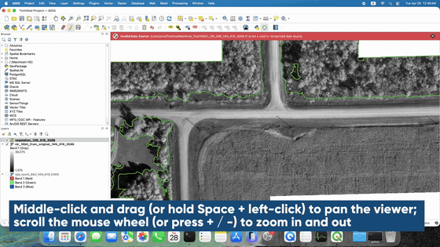
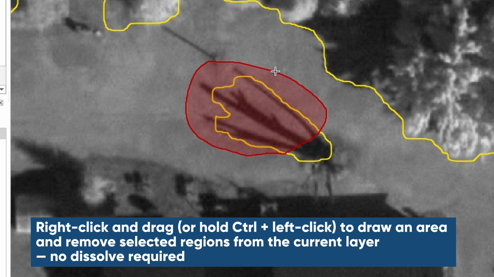
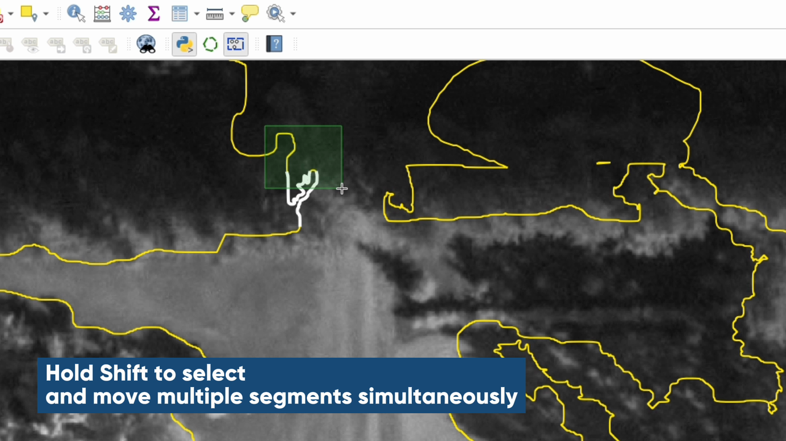
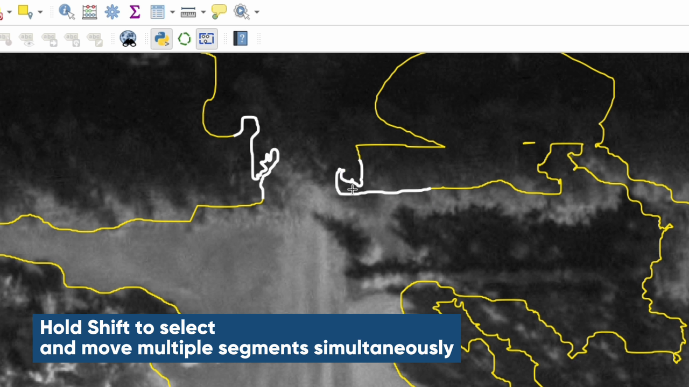

# Shp Lasso Tool


A QGIS plugin for fast polygon-layer editing on shapefiles (and any other vector polygon source) — **lasso add / subtract with auto-dissolve**, plus **rectangle-select translation of vertex chains** with stretching boundary edges.



---

## Features

### 🟢 Lasso edit
- **Left-drag** — draw a lasso; the area is **unioned** into any polygons it touches and dissolved into a single feature. If the lasso doesn't touch any feature, a new polygon is created (inheriting attributes from a nearby feature so it falls into the same renderer category).
- **Right-drag** (or **Ctrl+Left-drag**) — the lasso area is **subtracted** from every polygon it touches. Resulting holes / fragments are kept; features that are completely consumed are deleted.



### 🔵 Edge multi-select
- **Left-drag** an empty area — draws a marquee; polygon vertices inside are highlighted as **white chains**.
- **Shift+Left-drag** — additive marquee; merges into the existing selection (rectangle turns green to confirm additive mode).
- **Left-drag** on the highlighted chain — translates every selected vertex by the same delta. Unselected neighbours stay put, so the boundary edges connecting to them **stretch automatically**.
- **Arrow keys** — nudge by 1 screen pixel (zoom-aware, so 1 px stays consistent across zoom levels).
- **Shift+Arrow** — nudge by 10 screen pixels.
- **Esc** or click outside — clear selection.




### Common controls (both tools)
| Action | Input |
| --- | --- |
| Pan | Middle-drag · or · Space+Left-drag |
| Zoom (cursor-centred) | Mouse wheel · or · `+` / `-` keys |

---

## Install

### Option A — QGIS Plugin Manager (recommended, once published)
1. **Plugins → Manage and Install Plugins → All**
2. Search for `Shp Lasso Tool`
3. Click **Install**

### Option B — From a GitHub release zip
1. Go to [Releases](https://github.com/rfb-studio/shp-lasso-tool/releases) and download the latest `ShpLassoTool-vX.Y.Z.zip`.
2. **Plugins → Manage and Install Plugins → Install from ZIP**, point at the file.
3. Tick **Shp Lasso Tool** under **Installed**.

### Option C — Manual (developers / source install)
Copy or clone the `ShpLassoTool/` folder into your QGIS plugins directory:

| OS | QGIS plugins path |
| --- | --- |
| macOS | `~/Library/Application Support/QGIS/QGIS3/profiles/default/python/plugins/` |
| Windows | `%APPDATA%\QGIS\QGIS3\profiles\default\python\plugins\` |
| Linux | `~/.local/share/QGIS/QGIS3/profiles/default/python/plugins/` |

(Replace `QGIS3` with `QGIS4` for QGIS 4.x.)

After installing by any method, **fully quit and relaunch QGIS** (Cmd+Q on macOS), then enable the plugin in **Plugins → Installed**.

---

## Requirements

- **QGIS 3.16+** or **QGIS 4.x**
- Python 3.9 / 3.10 / 3.11 / 3.12 (whichever your QGIS bundles)
- macOS, Windows, or Linux

No third-party Python packages required — uses only `qgis.core`, `qgis.gui`, `qgis.PyQt`, and the Python standard library.

---

## Quick usage

1. Open a project with at least one **polygon vector layer**.
2. Make that layer **active** in the Layers panel.
3. Click the green dashed-octagon icon (Lasso edit) **or** the blue dashed marquee icon (Edge multi-select) on the QGIS toolbar.
4. The tool starts editing if the layer isn't already in edit mode.

The plugin **does not auto-save**. After your edits, use QGIS's standard **Save Layer Edits** (Ctrl+S in the toolbar) to commit them to the file.

---

## Architecture

```
ShpLassoTool/
├── __init__.py            Plugin entry; classFactory hook for QGIS
├── metadata.txt           QGIS plugin metadata (read by Plugin Manager)
├── icon.png               Plugin icon (shown in Plugin Manager listings)
├── lasso_editor.py        Main plugin class; QAction registration, icon drawing
├── lasso_tool.py          Lasso add/subtract map tool (LassoEditTool)
└── edge_select_tool.py    Edge multi-select map tool (EdgeSelectTool)
```

The two map tools share the same pan/zoom gesture model (middle drag, Space+Left, mouse wheel, `+`/`-`) but otherwise are independent `QgsMapTool` subclasses.

---

## Development

```bash
git clone https://github.com/rfb-studio/shp-lasso-tool
cd shp-lasso-tool

# Symlink (or copy) ShpLassoTool/ into your QGIS plugins directory.
# macOS example:
ln -s "$(pwd)/ShpLassoTool" \
      "$HOME/Library/Application Support/QGIS/QGIS3/profiles/default/python/plugins/ShpLassoTool"
```

Iteration loop: edit `.py` files → fully quit QGIS (Cmd+Q) → reopen. Or install the [Plugin Reloader](https://plugins.qgis.org/plugins/plugin_reloader/) plugin to skip the restart.

See [CONTRIBUTING.md](CONTRIBUTING.md) for code style and PR guidelines.

---

## License

Copyright (C) 2026 RFB Studio Ltd.

This program is free software: you can redistribute it and/or modify it under the terms of the **GNU General Public License v3.0** as published by the Free Software Foundation. See [LICENSE](LICENSE) for the full terms.

This program is distributed in the hope that it will be useful, but **WITHOUT ANY WARRANTY**; without even the implied warranty of MERCHANTABILITY or FITNESS FOR A PARTICULAR PURPOSE.

QGIS, PyQGIS, Qt, and Python are products of their respective owners; this plugin uses their public APIs but is not affiliated with them.

---

## Acknowledgements

- The **QGIS Development Team** — for the QGIS application and its excellent plugin API.
- The **Qt Company** and the **Python Software Foundation** — for the underlying frameworks.

---

## Contact

- **Issues / bug reports / feature requests:** [GitHub Issues](https://github.com/rfb-studio/shp-lasso-tool/issues)
- **Maintainer:** RFB Studio Ltd.
